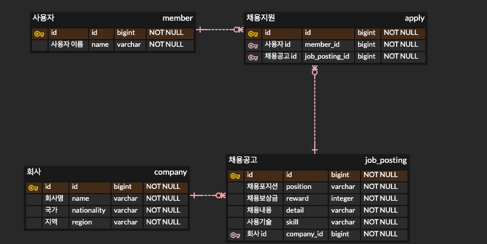

# 원티드 프리온보딩 백엔드 인턴십 선발과제

## 사용 기술
- Java 17
- SpringBoot 3.1.4
- H2 Database
- Spring Data JPA

## API

## ERD

## Git commit 메시지 컨벤션
- [udacity 스타일](https://udacity.github.io/git-styleguide/)을 따랐습니다.

## 테스트 구조
- Integration Tests
  - controllers/...IntegrationTest.java 파일 이름 컨벤션을 갖습니다.
  - API 모든 엔드포인트를 대상으로 작성되었습니다.
